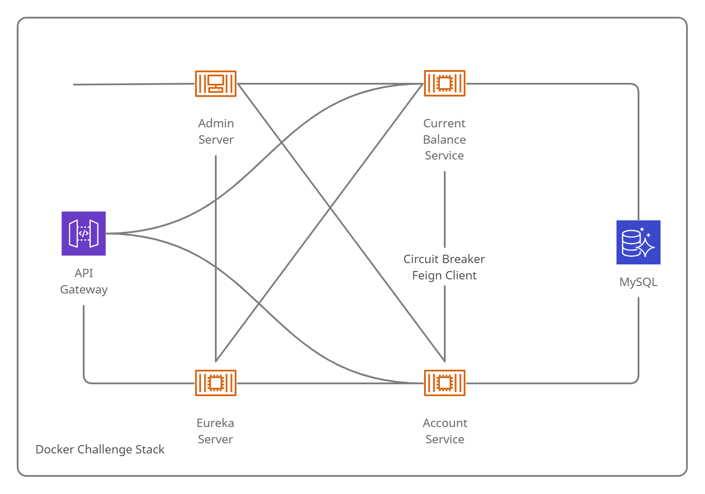

# Back-End-Challenge
---

## Descripcion

Proyecto solicitado por [GBM](https://gbm.com/) como reto para demostrar habilidades de programación.

Se trata de una pequeña API con la que un usuario puede comprar y vender acciones, asi como actualizar su crédito o inclusive eliminar su cuenta si asi lo desea.

Para su funcionamiento se opto por una arquitectura de microservicios, se trato de replicar la siguiente arquitectura en **Docker**:

Por lo que se crearon 5 microservicios y una base de datos:

- mysql: Base de datos **MySQL 8**
- registry-service: **Spring Cloud Eureka** Server (Su objetivo es registrar y localizar microservicios existentes, informar de su localización, su estado y datos relevantes de cada uno de ellos.)
- gateway-service: **Spring Cloud Gateway** (Se encargan de proporcionar un punto de entrada unificado a nuestro ecosistema de microservicios)
- admin-service: **Spring Boot Admin** (Servicio que proporciona una interfaz gráfica para visualizar la informacion que proporciona **Spring Boot Actuator**)
- account-service: Microservicio que proporciona una **API REST** para la gestión de cuentas y operaciones
- movement-service: Microservicio para la gestión de acciones de una cuenta

Todos estos servicios trabajan en conjunto para proporcionar una API con caracteristicas como:

- Escalamiento
- Balanceo de carga
- Visualización de métricas
- Persistencia

Los servicios **account-service** y **movement-service** no se ejecutan en un puerto fijo, pudiendo tener mas de una instancia ejecutando al mismo tiempo y permitiendo buen rendimiento en altas demandas.

Estos servicios capaces de comunicarse mediante un balanceador de carga del lado de cliente llamado **Spring Cloud Feign**, además de esto, las conexiones están protegidas con **resilience4j-circuitbreaker**, esto permite que, aunque se tengan errores en la petición a un servicio, se pueda seguir atendiendo al consumidor con una respuesta parcial.

Estos servicios cuentan también con **Swagger-UI** para fácil manejo de documentación y creación de clientes automática.

## ¿Cómo ejecutar el proyecto?

Al ser un proyecto pensado en el paradigma de microservicios, la forma más fácil de ejecutarlo en mediante Docker, una vez lo tengas instalado en tu equipo y te encuentres posicionado en la carpeta del proyecto, puedes ejecutar cualquiera de los siguientes comandos:

En caso de querer ver todos los logs: `docker-compose up`

Caso contrario: `docker-compose up -d`

Esto compilara y ejecutara cada uno de los microservicios, permitiéndote asi realizar pruebas. Si lo deseas puedes cambiar las variables de entorno del archivo docker-compose.yml.

## Endpoints

Una vez tengas en proyecto ejecutándose, podrás acceder a los microservicios, en las siguientes rutas:

- Eureka [http://localhost:8099/](http://localhost:8099/)
- Admin Server [http://localhost:8086/](http://localhost:8086/)
- Account Swagger [http://localhost:8080/accounts/swagger-ui/](http://localhost:8080/accounts/swagger-ui/)
- Movements Swagger [http://localhost:8080/movements/swagger-ui/](http://localhost:8080/movements/swagger-ui/)

En Admin Server y cualquiera de los 2 Swaggers podrás obtener informacion del funcionamiento de las APIs.

Espero este trabajo los impresione aunque sea un poco 😉

